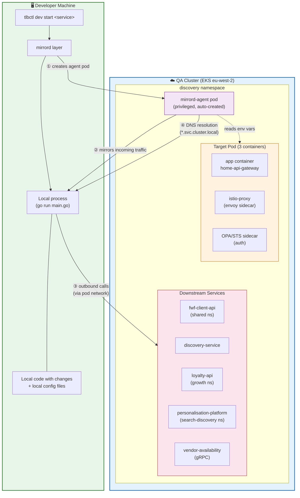

# Local Development Initiative — Plan

**Owner:** Avijeet Gaikwad
**Status:** In Progress
**Created:** 2026-06-26
**Last Updated:** 2026-06-26

---

## Vision

Any developer at Talabat can run any service locally with a single command, connected to real QA environment resources, with zero manual configuration.

```bash
# The dream
tlbctl dev start <service-name>
```

---

## Goals

1. **Dead simple setup** — minimal steps, no tribal knowledge required
2. **Scales across all services** — one approach that works for any Go/Node/Python service
3. **Zero manual env var config** — auto-inherits everything from the target pod
4. **No custom Docker Compose or mocks** — connects to real QA resources
5. **Safe by default** — mirror mode, no impact on QA users
6. **No deep Kubernetes knowledge needed** — developer just runs one command
7. **Eliminates "works on my machine"** — same config as QA
8. **Fast feedback loops** — edit code locally, see it exercised by real traffic instantly

---

## Phases

### Phase 1: Foundation — Validate & Generalise (Weeks 1–2)

Validate the mirrord approach works beyond home-api-gateway and identify common patterns/blockers across different service types.

| # | Task | Assignee | Status | Notes |
|---|------|----------|--------|-------|
| 1.1 | Spike: mirrord with talabat-home-api-gateway (Go + Lura) | | ✅ Done | Validated. See mirrord-local-dev-setup.md |
| 1.2 | Spike: mirrord with a second Go service (different namespace) | | 🔲 Todo | Pick a simpler service without Lura to validate generalisability |
| 1.3 | Spike: mirrord with a Node.js service | | 🔲 Todo | Validate mirrord works with Node runtime |
| 1.4 | Document common blockers per service type | | 🔲 Todo | Config paths, IRSA, sidecars, etc. |
| 1.5 | Catalogue env var patterns across services | | 🔲 Todo | Identify which env vars typically need overrides (config files, secrets paths) vs. which can be inherited as-is |
| 1.6 | Investigate IRSA/S3 credential forwarding | | 🔲 Todo | Can we pass AWS credentials to local process? Web identity token? |
| 1.7 | Investigate STS/OPA sidecar auth workarounds | | 🔲 Todo | Options: service account token injection, skip auth in mirror mode, etc. |

### Phase 2: Automation — Build the CLI Wrapper (Weeks 3–4)

Build tooling that auto-generates mirrord config and handles common setup steps.

| # | Task | Assignee | Status | Notes |
|---|------|----------|--------|-------|
| 2.1 | Design CLI interface and UX (`tlbctl dev` or standalone tool) | | 🔲 Todo | Decide: extend tlbctl vs. new tool vs. Makefile target |
| 2.2 | Auto-discover deployment name and namespace from repo | | 🔲 Todo | Convention-based: read from deployment.yaml, Helm chart, or repo name mapping |
| 2.3 | Auto-detect config file env vars that need local overrides | | 🔲 Todo | Scan pod env vars for paths like `/etc/...`, `/config/...` and map to local `configs/` |
| 2.4 | Auto-detect cluster context from environment/namespace | | 🔲 Todo | Map namespace → cluster context automatically |
| 2.5 | Generate `.mirrord/mirrord.json` dynamically | | 🔲 Todo | Template with target, namespace, env overrides filled in |
| 2.6 | Handle prerequisites check (mirrord installed, WARP off, VPN on, AWS creds valid) | | 🔲 Todo | Pre-flight checks before launching |
| 2.7 | Detect entrypoint automatically (main.go, npm start, etc.) | | 🔲 Todo | Read from Dockerfile, Makefile, or convention |
| 2.8 | One-command launch: `tlbctl dev start <service>` | | 🔲 Todo | Combines all above into a single command |

### Phase 3: Hardening — Solve Remaining Blockers (Weeks 4–6)

Address the known limitations discovered in Phase 1.

| # | Task | Assignee | Status | Notes |
|---|------|----------|--------|-------|
| 3.1 | Evaluate mirrord Operator (Teams) for filtered steal mode with istio | | 🔲 Todo | Contact MetalBear for trial/pricing. Needed for safe steal mode with service mesh |
| 3.2 | Solve IRSA credential forwarding for S3/DynamoDB access | | 🔲 Todo | Options: assume-role locally, env var override with temp creds |
| 3.3 | Solve STS/OPA auth for outbound calls | | 🔲 Todo | May need sidecar emulation or token injection |
| 3.4 | Handle gRPC services (vendor-availability uses gRPC) | | 🔲 Todo | Verify mirrord handles gRPC traffic correctly |
| 3.5 | Handle multi-container pods (sidecars, init containers) | | 🔲 Todo | Ensure correct container is targeted |
| 3.6 | Test with services that use Kafka/SQS consumers | | 🔲 Todo | Event-driven services may need different mirrord config |
| 3.7 | Cloudflare WARP conflict — find a permanent solution | | 🔲 Todo | Split tunnel config? Coordinate with infra/security team |

### Phase 4: Rollout & Adoption (Weeks 6–8)

Make it available to all teams and drive adoption.

| # | Task | Assignee | Status | Notes |
|---|------|----------|--------|-------|
| 4.1 | Write developer-facing documentation (README, getting started) | | 🔲 Todo | Simple, step-by-step, with screenshots |
| 4.2 | Create onboarding guide / video walkthrough | | 🔲 Todo | 5-min "zero to mirroring" demo |
| 4.3 | Add `make dev` or `make mirror` target to service templates | | 🔲 Todo | So new services get it out of the box |
| 4.4 | Pilot with 2–3 teams outside discovery | | 🔲 Todo | Get feedback, iterate |
| 4.5 | Internal tech talk / demo to engineering | | 🔲 Todo | Drive awareness and adoption |
| 4.6 | Set up support channel (Slack) for questions | | 🔲 Todo | #local-dev-help or similar |
| 4.7 | Collect metrics on adoption and developer satisfaction | | 🔲 Todo | Survey, usage tracking |

---

## Architecture



---

## Risks & Mitigations

| Risk | Impact | Mitigation |
|------|--------|------------|
| Steal mode breaks QA | High | Default to mirror mode. Steal requires explicit opt-in + operator |
| WARP/VPN conflict | Medium | Document workaround. Long-term: split tunnel config with security team |
| RBAC restrictions on new namespaces | Medium | Work with platform team to ensure `agent.privileged` is allowed |
| mirrord doesn't support a service's runtime | Low | Phase 1 validates Go + Node. Expand as needed |
| MetalBear pricing for Operator | Medium | Evaluate during Phase 3. Mirror mode works without it |
| Developer resistance to new tooling | Medium | Make it genuinely easier than current setup. Demo early, iterate on UX |

---

## Success Criteria

- [ ] Any developer can run a service locally in under 5 minutes with one command
- [ ] Works for at least 3 different service types (Go, Node, gRPC)
- [ ] Zero env var manual configuration needed
- [ ] No QA impact from local development (mirror mode default)
- [ ] Adopted by at least 3 teams outside discovery
- [ ] Positive developer feedback (>80% satisfaction in survey)

---

## References

- [mirrord](https://github.com/metalbear-co/mirrord)
- [mirrord docs](https://mirrord.dev/docs/overview/introduction/)
- [Spike results — home-api-gateway](./mirrord-local-dev-setup.md)
- [tlbctl](https://github.com/nickelization/tlbctl) — existing Talabat CLI for SSM tunneling
